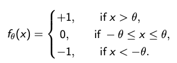

# Perceptron
 
## Problem Statement

Consider the feedforward neural network with the following training set:

Thus s(1) are s(2) and in one class, s(3) and s(4) are in another class, s(5) is in a third
class, and s(6) is in a fourth class.

**Use the perceptron learning rule to try to find a set of weights and bias to correctly classify the training set. Here we assume zero initial weights and bias, a learn rate α = 0.7, and a small but positive value of θ.**

## Transfer function used

## Perceptron Training Rule

1. Set learning rate α(> 0) and threshold θ. Initialize weights and bias to zero (or some random values)
2. Repeat the following steps, while cycling through the training set q = 1, 2, . . . , Q , until all training patterns are classified correctly
    1. Set activations for input vector 

                x = s(q)
    2. Compute total input for the output neuron:

                yin = x · w + b
    3. Compute the output

                y = fθ(yin).
    4. Update the weights and bias only if that pattern is misclassified

                w_new = w_old + αt(q)x,
                b_new =b_old +αt(q)

